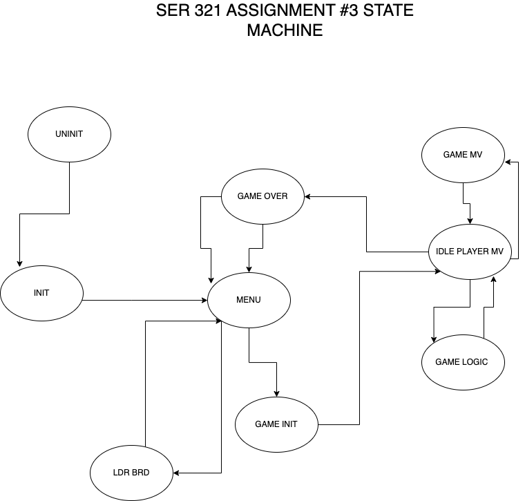

# Build/Run

Client:

    gradle runClientUDP [host] [port]

    gradle runClientTCP [host] [port]

    default port 8080
    default host localhost

Server:

    gradle runServer [port]

    gradle runServer  [port]  

    default port 8080

# Overview

Both the TCP and the UDP both use the same underlying logic to communicate with one another.
See the below section 'Communications' which details what packets are used by the server
and the client to communicate.

The below table describes differences and similarities between the underlying implementations of each
protocol: 

| Protocol | Re-attempt | Waits for response | Java Network Object  |
|----------|------------|--------------------|----------------------|
| TCP      | No         | Yes                | Socket, ServerSocket |
| UDP      | Yes        | Yes                | DatagramSocket       |

The most signficant Difference is that UDP will try and re-attempt sending the data if it does not receive a response in a reasonable amount of time. Another difference is the way
that images are sent in UDP which is described below.

# UDP Image Sending

The way that this should work, I say should because I did not get it to work, is that the
image data is sent in N number of packets where N is the Total Image Size / Max Chunk Size, 
with the Max Chunk Size being the largest image that can (or should) be sent in a UDP
packet (as far as the application is concerned).

One it has been determined that the Server wants to send an image via the img_flag, the 
client goes into a mode where it will wait for the image size to be sent by the server.
The cient will then tell the server just how many packets it needs to send based on the
process described above. 

The Server will then send each packet, and each time it will wait to determine if the
client recieved it, and then it will repeat the process until there are no more
packets to be sent. 
# Requirements

I am trying to make this part as easy as possible. In the code, I have marked each 
requirement with REQ-N where N corresponds to the requirement number as listed in 
the assignment document. 

E.g., 

    /**
     * sendClientInit
     * 
     * REQ 1
     */

     means that I believe I fufilled requirement using the corresponding code. Note that some of the requirements are
     marked in multiple spots since some of the requirements consist of seperate sub requirements. 

# Communications

Here is the State Machine that shows the different stages in the applicaiton, what follows is a summary of the communications and transitions between stages

1. Connection to the client

The client will send unininitialized state message to the server

    TX: {
            "state"     :   "GS_UNINIT"
        }

The server will respond with initialize message prompting the client that is
ready for the client to initialize it's modules. I am not sure why I did this
really, I doesn't really do a whole lot but it plays into the "uncoupledness"
of the application I suppose.

    RX: { "state"     :   "GS_INIT" }

2. The server will wait until the client sends the initialized state
indicating to us that everything is up and running on their end

TX: {
        "state"     :   "GS_INIT"
    }

Server will respond by requesting the name of the current user

RX: {
        "state"     :   "GS_GET_USR", 
        "data"      :   "Please enter your name",
    }

3. The client will send back their name and indicate that they are in the IDLE state,
this means that the client is ready to recieve commands from the server

RX: {
        "data"  :   "paul",
        "state" :   "GS_GET_USR"
    }

The server will respond with a menu command now that will give the user the option to either show the
current leader board, or play an actual game

{
    "data"  :  
            [
            "Play Game",
            "View leaderboard"
            ],

    "state" :   "GS_MENU"
}

{  "data"  :    [   "Play Game",  "View leaderboard"  ],  "state" :   "GS_MENU" }

4. The user will choose which option (via whatever interface they are using) and the
will then send the response

Client wants to play the game it will TX: 

{   
    "data":"Play the game",
    "state":"GS_GET_USR"
}

The server will respond asking the client if they would like to guess a city or a
country: 

{   
    "data"  :    
                [   "City",  "Country"  ],  
    "state" :   "GS_MENU" 
}

5. The cient responds just like in 3, and synchronizing the states:

{
    "data"  :  "city"

    "state" :   "GS_MENU"
}

The server will send the game initialization message which tells the client
a few things:

    1. What the name of the city/country is (just for debug, not actually used in
    client code)

    2. What the current word is. This will be N amount of blanks where N is the number
    of letters in the word

    3. Image flag set. This indicated that after this transmission, there is an image
    that will be sent

    4. Update message. Message for game play 

    5. Game state of game init. This is what tells the client that the game has officially
    started and the server is in "game mode"

    Here is the packet that is used (sent from the server)

    {
        "data":"rome",
        "curr_word":"____",
        "img_flag":true,
        "updt_msg":"Welcome. The game has started",
        "state":"GS_GAME_INIT","points":"0"
    }

6. From this point on, until the game is over, the client will send Game Move packets
which includes: 

    1. The move that they are making
        i.e., quit, single character, or other string. These will be interpreted by the
        game logic module
    2. Empty current word. 
    3. image: don't care
    4. Game State Move
    5. Points: don't care

Here is what the packet transmitted by the cient looks like:

    {   "data":"r",
        "curr_word":"",
        "img_flag":false,
        "updt_msg":"",
        "state":"GS_GAME_MV",
        "points":""
    }

The server will pass the move to the game logic module which will make a decision based on the input. i.e., was it a character guess or was it a full word guess? The server first checks for the quit message and if recieved, will stop the game.

After the game logic module has processed the move, if the user has in fact made a move and 
not quit, then it will pass back the Game Packet which contains all of the filled out 
fields that the user needs to know when playing the game. i.e, points, updated current word, and a friendly message. The server will also fill the "data" section of the packet with the return code from the game logic module so that the client can reference this if needed

Here is the packet sent back from the server after the game logic has been processed

{   "data":"GM_CODE_CH_WN",
    "curr_word":"r___",
    "img_flag":false,
    "updt_msg":"You got a character right",
    "state":"GS_GAME_MV",
    "points":"1"
}

This interaction goes back and forth until the game is ended: 

Client -> Server -> GameLogic -> Server -> Client .... Etc.

7. The game is officially over when the game module returns the return code of GM_CODE_PL_LS or GM_CODE_PL_WN to indicate if the player lost or won the game
respectively. Upon recieveing either code in the return packet after sending a move,
the client will do what it needs to do on its end, e.g., close the GUI. 

The server does not wait to send the next packet which is the Menu packet from step 3.

8. If the user say wanted to now view the leaderboard, they can reply to this message using the following command (see step 3)

{   "data":"View the leaderboard",
}

note that the game state and other items are irrelevant here. The client does not need to synch its game state until after the leaderboard has been received.

The server responds by sending the leaderboard in the packet under the data section. All other parts of the packet except the leaderboard and the game state (Leader Board) are not
used:

{   
    "data":"asd 5\npaul 5\nasdsa -5\npaul 5\nsds -5\nasd 5\nsds 5\nPaul -4\n",
    state":"GS_LDR_BRD",
    "points":""
}

10. The client, when done, will click the "Ok" button which will close the leaderboard (on the client side) and then send back a message letting the server know that is done: 

{  "data":"done" }

The client sends back the menu options, etc. 